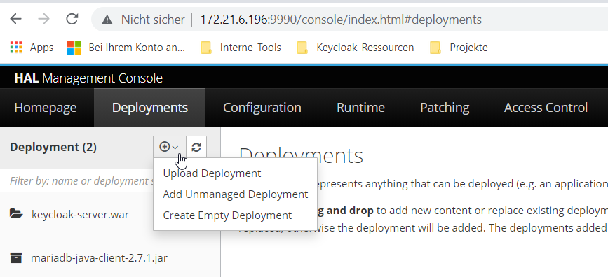
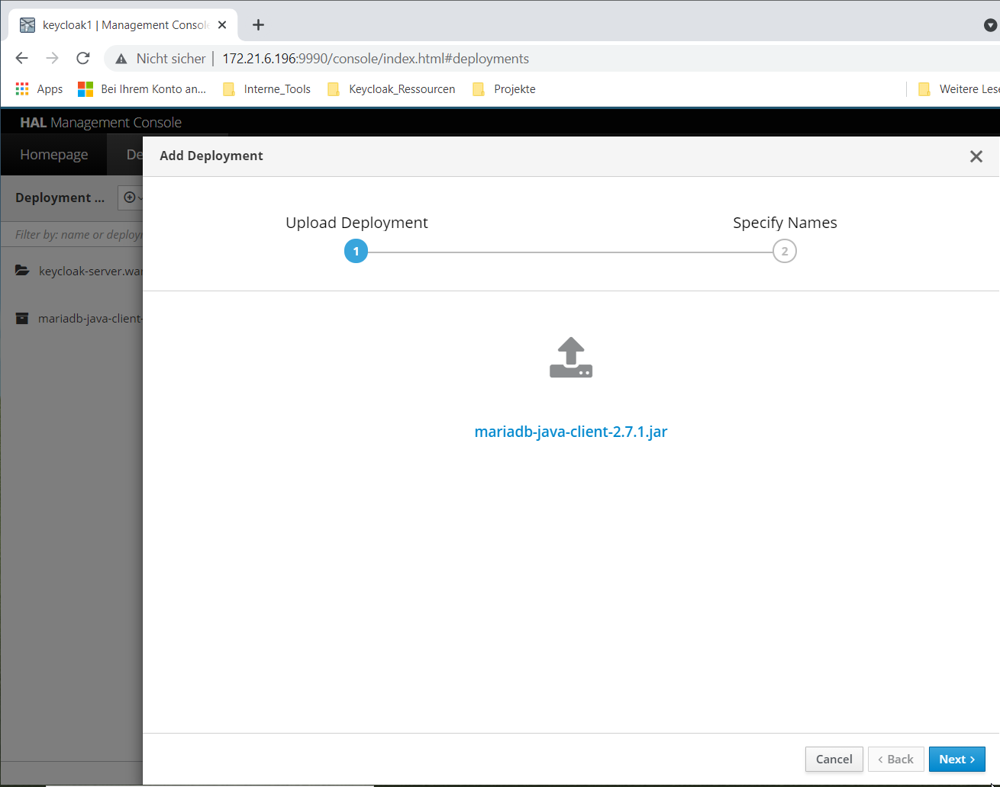
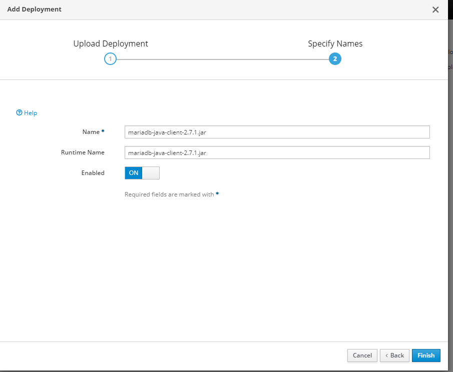
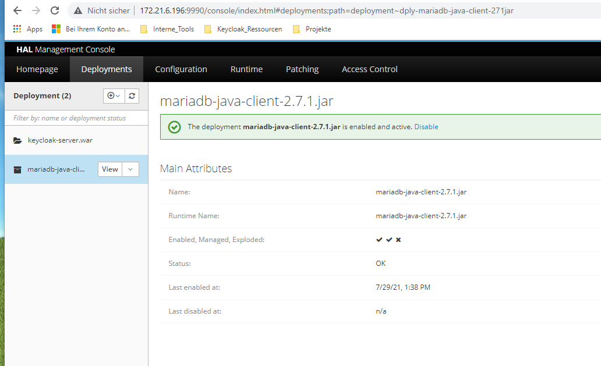

## Steps for deploying of JDBC-Driver
---

Prerequisites:
* You should already have the driver JAR-File for the Databasemanagementsystem you use save to your disk.
In our case this is MariaDB (https://downloads.mariadb.org/connector-java/).

* You should be already logged in into the HAL Management Console (Server-IP:9990)

---

1. Under the Entry 'Deployments' 
   click on the "+" and select "Upload Deployment".

<!--  --> 

 

2. In the new dialogue choose the JAR-File, which you downloaded before. 

 

3. Choose a name for the Deployment (will be referenced in the Datasource) and set it to enabled.

 

4. Reboot the Server and check the Deployments-Tab, it should look like below.

 

